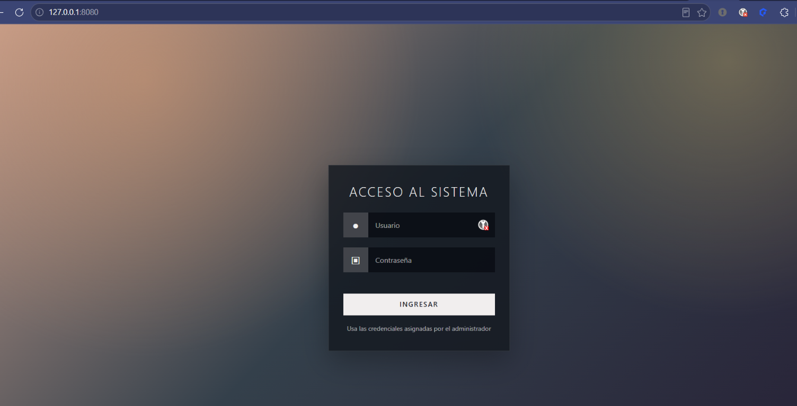
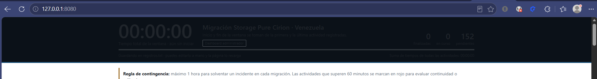

# Manual de uso

## 1. Acceso al sistema

Abre la dirección proporcionada por el administrador. En una instalación
local, utiliza:

```text
http://127.0.0.1:8080/
```

La pantalla de inicio solicita usuario y contraseña.

| Usuario | Contraseña | Perfil |
|---|---|---|
| `admin` | `admin` | Administrador |
| `user` | `user` | Usuario operativo |

El perfil se mantiene durante la sesión de la pestaña. Para cambiar de
usuario, selecciona **Cerrar sesión**.

> Estas credenciales son de demostración y se validan en el navegador. No
> deben utilizarse como autenticación segura en un entorno productivo.

### Pantalla de acceso



Escribe las credenciales del perfil correspondiente y selecciona **Ingresar**.

## 2. Perfil usuario operativo

El perfil `user` está diseñado para registrar la ejecución de las actividades.
Puede:

- Consultar las actividades del plan.
- Buscar por actividad, componente o nodo.
- Filtrar por estado y área.
- Iniciar una actividad.
- Finalizar una actividad en curso.
- Consultar el tiempo transcurrido y el orden de finalización.

No puede:

- Editar o borrar tiempos.
- Agregar, modificar o eliminar actividades.
- Cambiar horas planificadas.
- Reiniciar todos los tiempos.
- Exportar información.

### Registrar una actividad

1. Ubica la fase correspondiente.
2. Busca la actividad usando el campo **Buscar actividad o nodo** si es
   necesario.
3. Presiona **Iniciar** justo cuando comience la actividad.
4. La actividad cambiará a estado **En curso** y mostrará el tiempo
   transcurrido.
5. Presiona **Finalizar** cuando termine.
6. En la ventana **Comentario de la tarea**, escribe una observación si es
   necesario y selecciona **Guardar**. El comentario puede tener hasta 1000
   caracteres.
7. Verifica que aparezca la hora de inicio, la hora de fin y la duración.

Una actividad finalizada no puede corregirse desde este perfil. El comentario
sí puede agregarse o actualizarse con el botón **Comentario**. Si se registró
un tiempo incorrecto, solicita al administrador que lo ajuste.

### Consultar o actualizar un comentario

Después de finalizar una actividad, aparece el botón **Comentario**. Si ya
existe un comentario, el botón muestra **Ver comentario**. Selecciónalo para
consultar, modificar o borrar la observación y luego presiona **Guardar**.
Esta función está disponible para el perfil usuario y para el administrador.

### Vista general del dashboard



La barra superior resume el tiempo de la ventana de migración, las actividades
finalizadas, las que están en curso y las pendientes. Debajo se encuentran las
tarjetas de área, los filtros y el listado de actividades.

### Uso desde teléfono o tablet

La pantalla se adapta automáticamente al ancho disponible:

- En teléfonos, el encabezado y los filtros se organizan verticalmente.
- Las tarjetas de área aparecen en dos columnas.
- Cada actividad muestra primero sus datos, luego los tiempos y finalmente
  los botones de acción.
- Los diálogos de comentarios y edición ocupan el ancho disponible sin
  desbordarse.

Si rotas el dispositivo o cambias el tamaño de la ventana, la distribución se
ajusta automáticamente. Si el contenido no se actualiza después de una
actualización, utiliza **Ctrl + F5** en escritorio o recarga la página desde
el navegador del teléfono.

## 3. Perfil administrador

El perfil `admin` permite operar y mantener el plan completo.

### Iniciar y finalizar tiempos

El procedimiento normal es el mismo que para el usuario operativo:

1. Selecciona **Iniciar** al comenzar.
2. Selecciona **Finalizar** al terminar.
3. Revisa la duración registrada.
4. Al finalizar, agrega una observación en la ventana **Comentario de la
   tarea**. Tanto el administrador como el usuario operativo pueden consultar
   y actualizar ese comentario.

### Gestionar comentarios

En una actividad finalizada, selecciona **Comentario** o **Ver comentario**.
Escribe la observación operativa, corrige su contenido si es necesario o
déjala vacía para eliminarla. Presiona **Guardar** para conservar el cambio.

### Corregir tiempos

1. Selecciona el botón de opciones de la actividad.
2. Modifica **Inicio** o **Fin**.
3. Comprueba que el fin no sea anterior al inicio.
4. Selecciona **Guardar**.

Para borrar los tiempos de una actividad, abre sus opciones y selecciona
**Borrar tiempos**.

### Reiniciar todos los tiempos

En la barra de herramientas, selecciona **Reiniciar todos los tiempos**.
Confirma la operación solo si deseas borrar los inicios y finales registrados
de todas las actividades.

Esta acción no elimina las actividades ni modifica el plan, pero sí elimina
los tiempos registrados.

### Agregar una actividad

1. Selecciona **Agregar actividad** en la fase correspondiente.
2. Completa el nombre de la actividad.
3. Selecciona área y país.
4. Completa, si aplica, componente, nodos y hora planificada.
5. Selecciona **Agregar**.

Los nodos pueden escribirse separados por coma, punto y coma o espacios.

### Editar una actividad

1. Abre las opciones de la actividad.
2. Selecciona **Editar datos de la actividad**.
3. Modifica la información necesaria.
4. Selecciona **Guardar**.

Las actividades originales del plan conservan su fase y grupo. Las actividades
agregadas pueden eliminarse desde sus opciones.

### Ajustar la hora planificada

1. Selecciona la hora planificada de la actividad.
2. Introduce la nueva hora.
3. Selecciona **Guardar**.

Para una actividad original, puedes utilizar **Restaurar** para volver a la
hora definida en el plan.

### Exportar registros

Selecciona **Descargar Excel (CSV)**. El archivo incluye:

- Orden de finalización.
- Fase y grupo.
- Hora planificada.
- País, componente, área y nodos.
- Estado.
- Inicio y fin.
- Duración.
- Indicador de actividades que superan una hora.
- Comentario de la actividad.

El archivo CSV puede abrirse con Excel u otra hoja de cálculo.

## 4. Filtros y lectura del dashboard

### Filtros de estado

- **Todas:** muestra todas las actividades.
- **Pendientes:** actividades que aún no han iniciado.
- **En curso:** actividades con inicio, pero sin fin.
- **Finalizadas:** actividades con inicio y fin.

### Filtro por área

Selecciona una tarjeta de área para mostrar únicamente sus actividades.
Selecciona nuevamente la misma tarjeta para quitar el filtro.

### Búsqueda

El buscador permite localizar texto en:

- Nombre de la actividad.
- Grupo.
- Componente.
- Área.
- País.
- Nodos.

### Fases contraídas

Selecciona el encabezado de una fase para contraer o expandir sus actividades.

## 5. Indicadores de tiempo

- **Ventana:** tiempo entre la primera actividad iniciada y la última actividad
  registrada.
- **Suma de actividades:** suma de las duraciones individuales.
- **En curso:** cantidad de actividades iniciadas sin hora de fin.
- **Supera 1 h:** indica que una actividad lleva más de 60 minutos.
- **Orden de finalización:** posición de la actividad según su hora de fin.

La regla operativa del dashboard considera una hora como límite de contingencia
para evaluar continuidad o rollback.

## 6. Persistencia de datos

Cuando la aplicación se ejecuta con `server.py`, los registros se guardan en
`registros.txt`. La página consulta periódicamente el archivo y puede reflejar
cambios realizados por otro usuario.

Cada comentario se guarda junto con el inicio, el fin y los datos informativos
de su actividad. Los comentarios se conservan al recargar la página, reiniciar
el servicio o actualizar la aplicación. Si un comentario incluye el carácter
`|` o saltos de línea, la aplicación los normaliza para mantener el formato del
archivo.

El archivo se encuentra normalmente en:

```text
/opt/cronometro/registros.txt
```

No edites el archivo manualmente durante una operación activa salvo que sea
necesario y tengas autorización del administrador.

## 7. Problemas frecuentes

### La página no abre

Comprueba que el servidor esté ejecutándose:

```bash
sudo systemctl status cronometro
```

Consulta los últimos mensajes:

```bash
sudo journalctl -u cronometro -n 50 --no-pager
```

### Los cambios no aparecen

1. Espera unos segundos para que se sincronice el archivo.
2. Recarga la página.
3. Comprueba que todos los usuarios estén utilizando la misma dirección del
   servidor.
4. Si se publicó una actualización reciente, realiza una recarga forzada con
   **Ctrl + F5**. La sesión válida se conserva y el listado debe volver a
   mostrarse.

### El listado aparece vacío después de recargar

Comprueba que JavaScript esté habilitado y vuelve a cargar la página. Si el
problema continúa, abre la aplicación desde `server.py` en lugar de abrir
directamente el archivo HTML:

```text
http://127.0.0.1:8080/
```

En un servidor remoto, utiliza la dirección publicada por el administrador,
por ejemplo:

```text
http://IP_DEL_SERVIDOR:8080/
```

### El login no permite entrar

Verifica que las credenciales sean exactamente:

```text
admin / admin
user / user
```

Los valores distinguen los espacios y la contraseña distingue mayúsculas y
minúsculas.

### Se registró un tiempo equivocado

Solicita al administrador que corrija el tiempo desde las opciones de la
actividad. El perfil operativo no puede modificar registros finalizados.

## 8. Recomendaciones operativas

- Inicia y finaliza el tiempo en el momento real de cada actividad.
- No compartas las credenciales.
- Confirma el nombre de la actividad antes de iniciar el cronómetro.
- Revisa las actividades en curso antes de cerrar la sesión.
- Exporta un CSV al finalizar la migración.
- Solicita al administrador una copia de respaldo de `registros.txt`.
- Registra en los comentarios cualquier incidencia, validación o acción
  relevante al finalizar una actividad.
